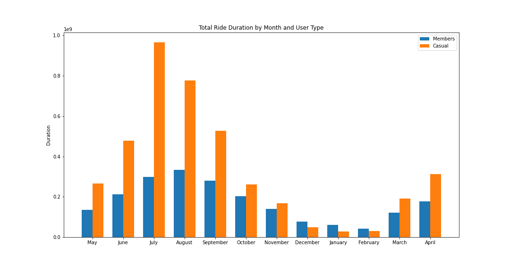

## Background

Cyclistic is a bike-share company operating in the city of Chicago. They offer three types of passes: single-ride, full-day, and annual membership. Annual memberships are most profitable to the company and the company has also determined that it would be most efficient to create a pipeline to convert customers from single-ride and full-day ride users (known as, "casual riders") to annual membership users. In order to do this, understanding how different riders use the company's services is important. As such,we have the following objective: **identify ways in which annual members and casual riders use Cyclistic bikes differently**. The answers to this question will allow the Cyclistic marketing team to target their strategies more effectively towards those people who are currently only casual riders.

The direct stakeholders in this scenario are Lily Moreno (director of marketing) and the executive team, which will make the final approval of any recommendations coming from this analysis.

## Data Source

We are using internal data provided by Cyclistic which tracks each individual ride over the most recent twelve months. Since we collected the data from our own records, we are confident in the reliability and completeness of the data. The dataset provides relevant information about the type, duration, and location of each ride, along with a description of the user type.  Each month's data was contained in a separate CSV file and merged together into a single CSV dataset using a Python script (see Cyclist_Compile.ipynb).

## Importing and cleaning

The following transformations and modifications were made to the original dataset (see Cyclist_Clean_Wrangle.ipynb):

1. Converted started_at and ended_at fields to datetime type

2. Deleted duplicate entries; the only ones were some strange copies of rides from one day in November that received alternate start dates in December (the end dates were still in November)

3. Removed any rides lasting less than a minute

4. Removed rides which started at HQ QR (these were for testing purposes)

5. Extracted the following separate columns from started_at and ended_at: start_date, month, day, day_name, start_time, end_time.

6. Created dur column for duration of rides

The cleaned data was saved as Version 2.

## Analysis

We compared the number of rides, proportion of rides, average duration, and total duration of rides between members and casual users grouped by both month and day of the week. We found the following results (see Cyclist_Analysis.ipynb):

1. In every single month, the number of rides by members exceeded those by casual riders (members made up about 59% of total rides throughout the year). Both types of ridership peaked in August and were at their lowest in January.

2. The proportion of member riders was at its lowest in July (51%) and highest in January (81%)

 

3. The average casual ride was much longer in every month. Overall the average casual ride was 2667 seconds compared to 965 for members, which is 176% longer. 

4. As a result of the longer average ride, casual users made up a significantly higher share of total ride duration during most months. The difference was the highest in the months May-September. In the winter months of December-February, when ridership was at its lowest, members made up the majority of ride minutes.

5. On weekdays, members made up a clear majority of rides, but on weekends, casual riders slightly edged out members.

6. The average ride duration for casual riders was over twice as long as for members on every day of the week. Average member ride duration was relatively stable across every day of the week, but casual ride length increased on the weekends.

7. Total ride duration for members was stable across the days of the week, but total casual ride duration increased dramatically on the weekends.

## Recommendations

As a result of the analysis, we have the following recommendations in order to market effectively to casual riders:

#### 1. Create a New Subscription Level

There are fewer casual rides being taken; as such, the casual rider might not want to commit to a full membership, but could be convinced of the benefits of an intermediate level membership. Since summertime is when casual riders make up the highest proportion of rides, we might be able to create seasonal memberships or monthly memberships to appeal to those riders.

#### 2. Market Towards Recreational Riders

Casual riders take significantly longer rides on average than members and tend to take more rides on weekends. This is likely due to differences in purpose of the rides: recreational for casual riders as opposed to commuting for members. In order to effectively market towards casual riders, we need to appeal to their fun side as opposed to their utilitarian senses.

#### 3. Time Ad Campaigns Toward Summer Months

While both types of riders were at the highest in the summer and lowest in the winter, casual riders represented even more extreme variation than member riders. As such, we should focus our adverising energy and money towards those months where the vast majority of casual riders use our service. Starting targed campaigns in early to mid-spring will likely have the biggest positive results for converting casual riders to members. 

